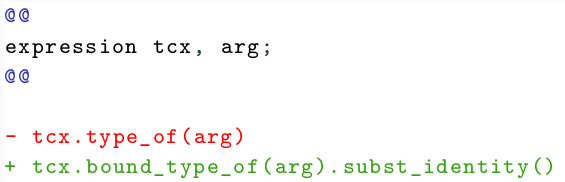
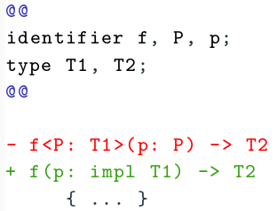

# Coccinelle for Rust

Coccinelle is a tool for automatic program matching and transformation that
was originally developed for making large scale changes to the Linux kernel
source code (ie, C code).  Matches and transformations are driven by
user-specific transformation rules having the form of abstracted patches,
referred to as semantic patches. As the Linux kernel, and systems software
more generally, is starting to adopt Rust, we are developing Coccinelle for
Rust, to make the power of Coccinelle available to Rust codebases.

## Examples

Changing a method call sequence in the Rust implementation:

Merging some lifetimes in tokio:

## Current status

Coccinelle for Rust is currently a prototype.  It relies on Rust Analyzer
for parsing and rustfmt for pretty printing.  It mainly supports matching
and transformation of expressions and types, but reasoning about control
flow is not yet supported.

## Availability

[Coccinelle for Rust](https://gitlab.inria.fr/coccinelle/coccinelleforrust.git)

[A recent talk about Coccinelle for Rust](https://gitlab.inria.fr/coccinelle/coccinelleforrust/-/blob/main/talks/rfl.pdf)

## Contact

- Julia Lawall: [Julia.Lawall@inria.fr](mailto:Julia.Lawall@inria.fr)
- Tathagata Roy: [tathagata.roy1278@gmail.com](mailto:tathagata.roy1278@gmail.com)
