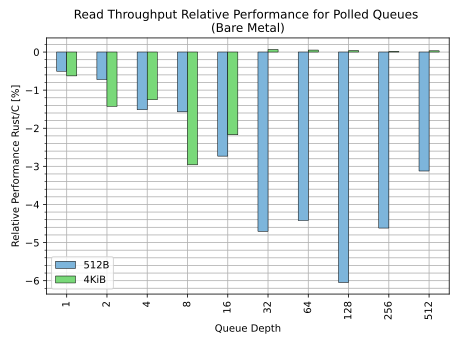

# NVMe Driver

The Rust NVMe driver is an effort to implement a PCI NVMe driver in safe Rust
for use in the Linux Kernel. The purpose of the driver is to provide a vehicle
for development of safe Rust abstractions and to prove feasibility of Rust as an
implementation language for high performance device drivers.

The Linux Rust NVMe driver lives
[here](https://github.com/metaspace/linux/tree/nvme). Please be aware that the
nvme branch is force pushed without notice. The Rust NVMe driver was originally
authored by Wedson Almeida Filho and is now maintained by Andreas Hindborg
(Samsung).

The driver is not currently suitable for general use.

# Resources
 - LPC 2022
   [slides](https://lpc.events/event/16/contributions/1180/attachments/1017/1961/deck.pdf)
   and [video](https://lpc.events/event/16/contributions/1180/attachments/1017/2249/go)

# Performance

Performance evaluation as of January 2023. 

## Setup

- Dell PowerEdge R6525
- 1 CPU socket populated - EPYC 7313, 16 cores
- 128 GB DRAM
- 3x P5800x 16GT/s x4 7.88 GB/s (PCIe 4)
- Debian bullseye (linux 5.19.0+)

## Results

## Analysis

For 4 KiB block size, the Rust NVMe driver performs similar to the C driver. For
this configuration the target drive is bandwidth limited.

For 512 B block size, the C driver outperforms the Rust driver by up to 6%. In
this configuration the drive is not bandwidth limited, but the benchmark becomes
compute limited. The Rust driver has a higher overhead and thus performs worse.

# Planned Work Items

  - Remove all unsafe code from the driver
  - Support device removal
  - Verify functionality by executing `blktests` and `xfstests` in CI
  - Add sys-fs nodes to allow use of nvme-cli with Rust NVMe driver
  - Support more kernel configurations by deferring initialization to a task queue
  - Improve performance of Rust NVMe driver

# Contact

Please contact Andreas Hindborg through
[Zulip](Contact.md#zulip-chat).
