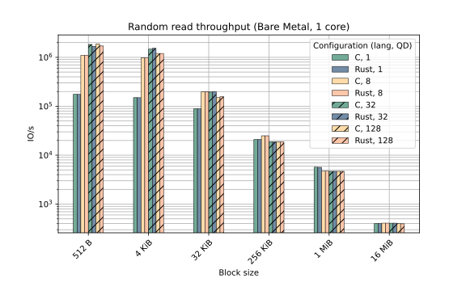
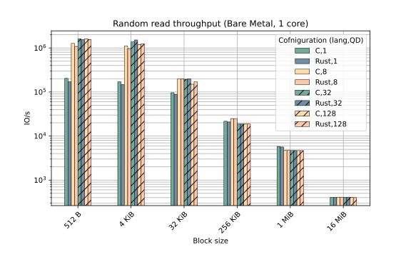
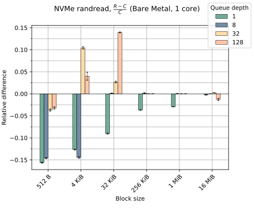
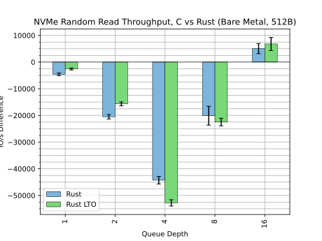
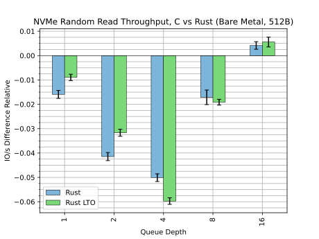
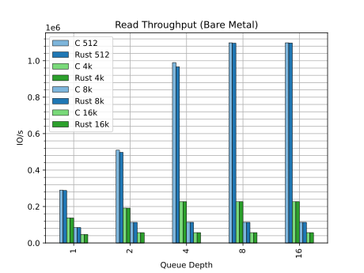

# NVMe Driver

The Rust NVMe driver is an effort to implement a PCI NVMe driver in safe Rust
for use in the Linux Kernel. The purpose of the driver is to provide a vehicle
for development of safe Rust abstractions and to prove feasibility of Rust as an
implementation language for high performance device drivers.

The Linux Rust NVMe driver lives
[here](https://github.com/metaspace/linux/tree/rnvme). This branch is routinely
rebased on upstream Linux releases. Please be aware that the `nvme` branch is
force pushed without notice. The version based on the deprecated `rust` branch
is available [here](https://github.com/metaspace/linux/tree/nvme-rust).

The Rust NVMe driver was originally
authored by Wedson Almeida Filho and is now maintained by Andreas Hindborg
(Samsung).

The driver is not currently suitable for general use.

## Resources
 - LPC 2022
   [slides](https://lpc.events/event/16/contributions/1180/attachments/1017/1961/deck.pdf)
   and [video](https://lpc.events/event/16/contributions/1180/attachments/1017/2249/go)

## 6.11-rc2 Rebase Performance ([`rnvme-v6.11-rc2`](https://git.kernel.org/pub/scm/linux/kernel/git/a.hindborg/linux.git/log/?h=rnvme-v6.11-rc2))

### Setup

 - AMD Ryzen 5 7600
 - 32 GB 4800 MT/s DDR5 on one channel
 - 1x Samsung 990 Pro 1TB (PCIe 4.0 x4 16 GT/S)
 - NixOS 24.05

### Results

- 40 samples
- Difference of means modeled with t-distribution
- P95 confidence intervals

The graph shows
    <math>
        <mfrac>
            <mrow>
                <mi>R</mi>
                <mo>-</mo>
                <mi>C</mi>
            </mrow>
            <mrow>
                <mi>C</mi>
            </mrow>
        </mfrac>
    </math>
where C is IO/s for the C driver and R is IO/s for the Rust driver. Thus, negative
means the C driver is faster while positive means the Rust driver is faster.

## 6.10 Rebase Performance ([`rnvme-v6.10`](https://git.kernel.org/pub/scm/linux/kernel/git/a.hindborg/linux.git/log/?h=rnvme-v6.10))

### Setup

 - AMD Ryzen 5 7600
 - 32 GB 4800 MT/s DDR5 on one channel
 - 1x Samsung 990 Pro 1TB (PCIe 4.0 x4 16 GT/S)
 - NixOS 24.05

### Results

- 40 samples
- Difference of means modeled with t-distribution
- P95 confidence intervals

The graph shows
    <math>
        <mfrac>
            <mrow>
                <mi>R</mi>
                <mo>-</mo>
                <mi>C</mi>
            </mrow>
            <mrow>
                <mi>C</mi>
            </mrow>
        </mfrac>
    </math>
where C is IO/s for the C driver and R is IO/s for the Rust driver. Thus, negative
means the C driver is faster while positive means the Rust driver is faster.

## 6.10-rc5 Rebase Performance ([`rnvme-v6.10-rc5`](https://github.com/metaspace/linux/tree/rnvme-v6.10-rc5))

### Setup

 - AMD Ryzen 5 7600
 - 32 GB 4800 MT/s DDR5 on one channel
 - 1x Samsung 990 Pro 1TB (PCIe 4.0 x4 16 GT/S)
 - NixOS 24.05

### Results

- 40 samples
- Difference of means modeled with t-distribution
- P95 confidence intervals

The graph shows
    <math>
        <mfrac>
            <mrow>
                <mi>R</mi>
                <mo>-</mo>
                <mi>C</mi>
            </mrow>
            <mrow>
                <mi>C</mi>
            </mrow>
        </mfrac>
    </math>
where C is IO/s for the C driver and R is IO/s for the Rust driver. Thus, negative
means the C driver is faster while positive means the Rust driver is faster.

## 6.9 Rebase Performance ([`rnvme-v6.9`](https://github.com/metaspace/linux/tree/rnvme-v6.9))

### Setup

 - AMD Ryzen 5 7600
 - 32 GB 4800 MT/s DDR5 on one channel
 - 1x Samsung 990 Pro 1TB (PCIe 4.0 x4 16 GT/S)
 - NixOS 24.05

### Results

- 40 samples
- Difference of means modeled with t-distribution
- P95 confidence intervals

The graph shows
    <math>
        <mfrac>
            <mrow>
                <mi>R</mi>
                <mo>-</mo>
                <mi>C</mi>
            </mrow>
            <mrow>
                <mi>C</mi>
            </mrow>
        </mfrac>
    </math>
where C is IO/s for the C driver and R is IO/s for the Rust driver. Thus, negative
means the C driver is faster while positive means the Rust driver is faster.

## 6.8 Rebase Performance ([`rnvme-v6.8`](https://github.com/metaspace/linux/tree/rnvme-v6.8))

### Setup

 - AMD Ryzen 5 7600
 - 32 GB 4800 MT/s DDR5 on one channel
 - 1x Samsung 990 Pro 1TB (PCIe 4.0 x4 16 GT/S)
 - NixOS 23.11

### Results

- 40 samples
- Difference of means modeled with t-distribution
- P95 confidence intervals

The graph shows
    <math>
        <mfrac>
            <mrow>
                <mi>R</mi>
                <mo>-</mo>
                <mi>C</mi>
            </mrow>
            <mrow>
                <mi>C</mi>
            </mrow>
        </mfrac>
    </math>
where C is IO/s for the C driver and R is IO/s for the Rust driver. Thus, negative
means the C driver is faster while positive means the Rust driver is faster.

## 6.7 Rebase Performance ([`nvme-6.7`](https://github.com/metaspace/linux/tree/nvme-6.7))

### Setup

 - 12th Gen Intel(R) Core(TM) i5-12600
 - 32 GB DRAM
 - 1x INTEL MEMPEK1W016GA (PCIe 3.0 x2)
 - Debian Bullseye userspace
 - LTO results are enabled by a build system patch (a hack) that was not yet published.

### Results

- 30 samples
- Difference of means modeled with t-distribution
- P99 confidence intervals

#### Difference Relative

Plot shows `(mean_iops_r - mean_iops_c) / mean_iops_c`'

## Performance November 2023 ([`nvme-6.6`](https://github.com/metaspace/linux/tree/nvme-6.6))

### Setup

 - 12th Gen Intel(R) Core(TM) i5-12600
 - 32 GB DRAM
 - 1x INTEL MEMPEK1W016GA (PCIe 3.0 x2)
 - Debian Bullseye userspace
 - LTO results are enabled by a build system patch (a hack) that was not yet published.

### Results

- 30 samples
- Difference of means modeled with t-distribution
- P99 confidence intervals

#### Difference

#### Difference Relative

Plot shows `(mean_iops_r - mean_iops_c) / mean_iops_c`'

## Performance September 2023

The driver was
[rebased](https://github.com/metaspace/linux/tree/7353a81d566510080f91099b1a2b31895c716c9d)
on top of
[`rust-next`](https://github.com/Rust-for-Linux/linux/commit/37152d4a7c6400a4250134e601eca8be1a2bbc16)
PR for 6.6 in September 2023.

### Setup

 - 12th Gen Intel(R) Core(TM) i5-12600
 - 32 GB DRAM
 - 1x INTEL MEMPEK1W016GA (PCIe 3.0 x2)
 - Debian Bullseye userspace

### Results

## Performance January 2023

Performance evaluation as of January 2023.

### Setup

- Dell PowerEdge R6525
- 1 CPU socket populated - EPYC 7313, 16 cores
- 128 GB DRAM
- 3x P5800x 16GT/s x4 7.88 GB/s (PCIe 4)
- Debian bullseye (linux 5.19.0+)

### Results

### Analysis

For 4 KiB block size, the Rust NVMe driver performs similar to the C driver. For
this configuration the target drive is bandwidth limited.

For 512 B block size, the C driver outperforms the Rust driver by up to 6%. In
this configuration the drive is not bandwidth limited, but the benchmark becomes
compute limited. The Rust driver has a higher overhead and thus performs worse.

## Work Items

  - Remove all unsafe code from the driver
  - Support device removal
  - Verify functionality by executing `blktests` and `xfstests` in CI
  - Add sys-fs nodes to allow use of `nvme-cli` with Rust NVMe driver
  - Support more kernel configurations by deferring initialization to a task queue
  - Improve performance of Rust NVMe driver

## Contact

Please contact Andreas Hindborg through
[Zulip](Contact.md#zulip-chat).
