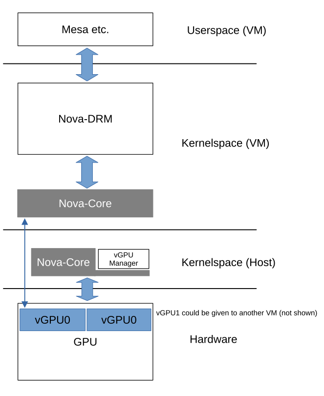

# Nova GPU Driver

Nova is a driver for GSP (GPU system processor) based Nvidia GPUs. It is
intended to become the successor of Nouveau as the mainline driver for Nvidia
(GSP) GPUs in Linux.

It will support all Nvidia GPUs beginning with the GeForce RTX20 (Turing family)
series and newer.

## Contact

Available communication channels are:

- The mailing list: nouveau@lists.freedesktop.org
- IRC: #nouveau on OFTC
- [Zulip Chat](https://rust-for-linux.zulipchat.com/#narrow/channel/509436-Nova)

## Resources

The parts that are already in mainline Linux can be found in
`drivers/gpu/nova-core/` and `drivers/gpu/drm/nova/`

The development repository for the in-tree driver is located on
[Freedesktop](https://gitlab.freedesktop.org/drm/nova).

## Background

### Why a new driver?

Nouveau was, for the most part, designed for pre-GSP hardware. The driver exists
since ~2009 and its authors back in the day had to reverse engineer a lot about
the hardware's internals, resulting in a relatively difficult to maintain
codebase.

Moreover, Nouveau's maintainers concluded that a new driver, exclusively for
GSP hardware, would allow for significantly simplifying the driver design: Most
of the hardware internals that Nouveau had to reverse engineer reside in the
GSP firmware. Hereby, the GSP takes up the role of a hardware abstraction layer
which communicates with the host kernel through IPC. Thereby, a lot of the
stack's complexity is moved from the GPU driver into the GSP firmware.

This, in consequence, enables better maintainability. Another chance with a new
driver is to obtain active community participation from the very beginning.

### Why write it in Rust?

Rust's most desired feature are its guarantees for memory safety, notably the
elimination of Use-after-Free errors. Those are errors GPU drivers suffer from
significantly, because GPUs are, by definition, asynchronous in regards to the
CPU and can handle a great many jobs (i.e., memory objects) simultaneously.
Jobs' status can be changed at different places in the code base at different
points in time (through work items, interrupt handlers, userspace calls, ...).

In short, GPU drivers were expected to profit the most from the promised memory
safety.

Since Nova is a freshly written new driver, it was an opportunity to try to
leverage the advantages of Rust and obtain a more reliable, maintainable driver.

Another reason is that Rust's macro system are helpful when creating firmware
bindings for continuously changing firmware versions and their ABIs.

## Architecture

The overall GPU driver is split into two parts:

1. "Nova-Core", living in `drivers/gpu/nova-core/`. Nova-Core implements
   the fundamental interaction with the hardware (through PCI etc.) and,
   notably, boots up the GSP and interacts with it through a command queue.
2. "Nova-DRM" (the official name is actually just "Nova", but to avoid
   confusion developers usually call it "Nova-DRM"), living in
   `drivers/gpu/drm/nova/`. This is the actual graphics driver,
   implementing all the typical DRM interfaces for userspace.

This split architecture allows for virtualizing GPUs: Nova-Core can be used to
instruct the GPU's firmware to spawn a new PCI subdevice (Through
[SR-IOV](https://docs.kernel.org/PCI/pci-iov-howto.html)), thus
creating new PCI virtual functions), which can then be passed to a virtual
machine, which then, for example, can run another Linux with another Nova-Core
bound to the virtual GPU. Then, on top, Nova-DRM can be utilized as a
conventional GPU driver to use the vGPU.

Of course, it is also possible to use Nova-Core + Nova-DRM on one physical
machine, then directly using the GPU through Mesa in the host's userspace.

For more details about vGPUs, take a look at
[Zhi's announcement email](https://lore.kernel.org/nouveau/20240922124951.1946072-1-zhiw@nvidia.com/).

## Status and Contributing

The necessary Rust infrastructure has been progressing a lot. Current work now
focuses more on the actual driver. In case you want to contribute, take a look
at the
[NOVA TODO List](https://docs.kernel.org/gpu/nova/core/todo.html).

Don't hesitate reaching out on the aforementioned community channels.
