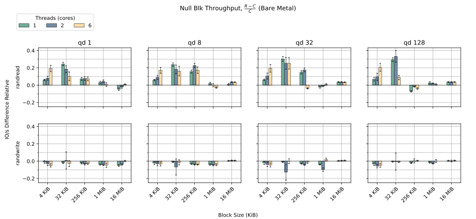
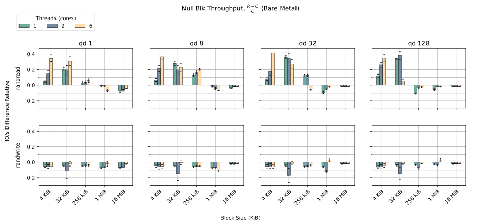
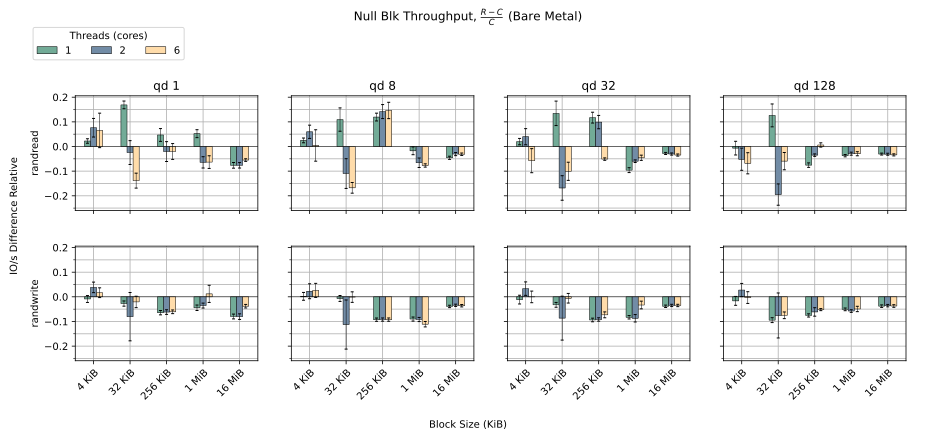
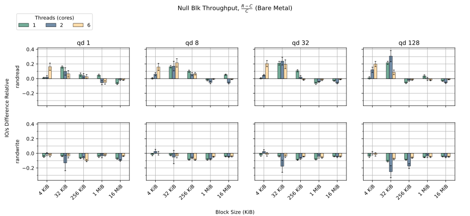
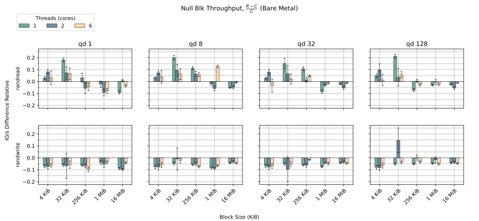

# Null Block Driver

The Rust null block driver `rnull` is an effort to implement a drop in
replacement for `null_blk` in Rust.

A null block driver is a good opportunity to evaluate Rust bindings for the
block layer. It is a small and simple driver and thus should be simple to reason
about. Further, the null block driver is not usually deployed in production
environments. Thus, it should be fairly straight forward to review, and any
potential issues are not going to bring down any production workloads.

Being small and simple, the null block driver is a good place to introduce the
Linux kernel storage community to Rust. This will help prepare the community for
future Rust projects and facilitate a better maintenance process for these
projects.

[Statistics](https://lore.kernel.org/all/87y1ofj5tt.fsf@metaspace.dk/) from the
commit log of the [C `null_blk`
driver](https://git.kernel.org/pub/scm/linux/kernel/git/torvalds/linux.git/log/drivers/block/null_blk?h=v6.1)
([before
move](https://git.kernel.org/pub/scm/linux/kernel/git/torvalds/linux.git/log/drivers/block/null_blk_main.c?h=v6.1&id=ea17fd354ca8afd3e8962a77236b1a9a59262fdd))
show that the C null block driver has had a significant amount of memory safety
related problems in the past. 41% of fixes merged for the C null block driver
are fixes for memory safety issues. This makes the null block driver a good
candidate for rewriting in Rust.

The driver is implemented entirely in safe Rust, with all unsafe code fully
contained in the abstractions that wrap the C APIs.

Please note that the performance measurements on this page might be misleading
due to the results not being normally distributed. [This
analysis](https://metaspace.github.io/2024/12/02/problems-in-benchmark-land.html)
has more details. We observe that issue is resovled for v6.14-rc5, but we are
monitoring the situation going forward.

## Features

Implemented features:

 - `blk-mq` support
 - Direct completion
 - SoftIRQ completion
 - Timer completion
 - Read and write requests
 - Optional memory backing
 - Bio-based submission
 - NUMA support
 - Block size configuration
 - Multiple devices
 - Dynamic device creation/destruction
 - Queue count configuration

Features available in the C `null_blk` driver that are currently not implemented
in this work:

 - Queue depth configuration
 - Discard operation support
 - Cache emulation
 - Bandwidth throttling
 - Per node hctx
 - IO scheduler configuration
 - Blocking submission mode
 - Shared tags configuration (for >1 device)
 - Zoned storage support
 - Bad block simulation
 - Poll queues

## Resources

 - [Latest patches](https://git.kernel.org/pub/scm/linux/kernel/git/a.hindborg/linux.git/log/?h=rnull)
 - [Original RFC Patches](https://github.com/metaspace/linux/tree/null_block-RFC)
 - [Mailing List Post](https://lore.kernel.org/all/20230503090708.2524310-1-nmi@metaspace.dk/)
 - [Subset merged in v6.11-rc1](https://lore.kernel.org/all/20240611114551.228679-1-nmi@metaspace.dk/)

## 6.14-rc5 Rebase ([`rnull-v6.14-rc5`](https://git.kernel.org/pub/scm/linux/kernel/git/a.hindborg/linux.git/log/?h=rnull-v6.14-rc5))

Changes from `rnull-v6.13`:

 - Change reference counting scheme for `Request`.
 - Move `rnull` driver to separate directory.
 - Rename `RawWriter` to `BufferWriter` and move it.
 - Enable configuration of `rnull` via `configfs`.
   - Enable dynamic createion/destruction of devices via `configfs`.
 - Use `Owned` for rust managed `Page` objects.
 - Change segment iterator to prevent concurrent mutable access to pages.
 - Use `GFP_NOIO` flag for backing rnull pages.
 - Add `user_per_node_hctx` rnull config option.
 - Add NUMA home node rnull config option.
 - Add submit queue count rnull config option.
 - Fix a bug where unwritten bytes were not zeroed on read.
 - Properly handle IO requests that are not equal in size to one block.

### Performance

#### Setup

 - AMD Ryzen 5 7600
 - 32 GB 4800 MT/s DDR5 on one channel
 - 1x Samsung 990 Pro 1TB (PCIe 4.0 x4 16 GT/S)
 - NixOS 24.11

#### Results

- Plot shows `(mean_iops_r - mean_iops_c) / mean_iops_c`
- 40 samples for each configuration
- Difference of means modeled with t-distribution
- P95 confidence intervals

## 6.13 Rebase ([`rnull-v6.13`](https://git.kernel.org/pub/scm/linux/kernel/git/a.hindborg/linux.git/log/?h=rnull-v6.13))

Changes from `rnull-v6.12`:

 - None

### Performance

#### Setup

 - AMD Ryzen 5 7600
 - 32 GB 4800 MT/s DDR5 on one channel
 - 1x Samsung 990 Pro 1TB (PCIe 4.0 x4 16 GT/S)
 - NixOS 24.05

#### Results

- Plot shows `(mean_iops_r - mean_iops_c) / mean_iops_c`
- 40 samples for each configuration
- Difference of means modeled with t-distribution
- P95 confidence intervals

## 6.12 Rebase ([`rnull-v6.12`](https://git.kernel.org/pub/scm/linux/kernel/git/a.hindborg/linux.git/log/?h=rnull-v6.12))

Changes from `rnull-v6.12-rc2`:

 - None

### Performance

#### Setup

 - AMD Ryzen 5 7600
 - 32 GB 4800 MT/s DDR5 on one channel
 - 1x Samsung 990 Pro 1TB (PCIe 4.0 x4 16 GT/S)
 - NixOS 24.05

#### Results

- Plot shows `(mean_iops_r - mean_iops_c) / mean_iops_c`
- 40 samples for each configuration
- Difference of means modeled with t-distribution
- P95 confidence intervals

## 6.12-rc2 Rebase ([`rnull-v6.12-rc2`](https://git.kernel.org/pub/scm/linux/kernel/git/a.hindborg/linux.git/log/?h=rnull-v6.12-rc2))

Changes from `rnull-v6.11`:

 - Make `QueueData` references pinned.

### Performance

#### Setup

 - AMD Ryzen 5 7600
 - 32 GB 4800 MT/s DDR5 on one channel
 - 1x Samsung 990 Pro 1TB (PCIe 4.0 x4 16 GT/S)
 - NixOS 24.05

#### Results

- Plot shows `(mean_iops_r - mean_iops_c) / mean_iops_c`
- 40 samples for each configuration
- Difference of means modeled with t-distribution
- P95 confidence intervals

## 6.11 Rebase ([`rnull-v6.11`](https://git.kernel.org/pub/scm/linux/kernel/git/a.hindborg/linux.git/log/?h=rnull-v6.11))

Changes from `rnull-v6.10`:

 - None.

### Performance

#### Setup

 - AMD Ryzen 5 7600
 - 32 GB 4800 MT/s DDR5 on one channel
 - 1x Samsung 990 Pro 1TB (PCIe 4.0 x4 16 GT/S)
 - NixOS 24.05

#### Results

- Plot shows `(mean_iops_r - mean_iops_c) / mean_iops_c`
- 40 samples for each configuration
- Difference of means modeled with t-distribution
- P95 confidence intervals

## 6.11-rc2 Rebase ([`rnull-v6.11-rc2`](https://git.kernel.org/pub/scm/linux/kernel/git/a.hindborg/linux.git/log/?h=rnull-v6.11-rc2))

Changes from `rnull-v6.10`:

 - Base abstractions merged upstream 🥳
 - Use atomic queue limits C API for setting queue limits.

### Performance

#### Setup

 - AMD Ryzen 5 7600
 - 32 GB 4800 MT/s DDR5 on one channel
 - 1x Samsung 990 Pro 1TB (PCIe 4.0 x4 16 GT/S)
 - NixOS 24.05

#### Results

- Plot shows `(mean_iops_r - mean_iops_c) / mean_iops_c`
- 40 samples for each configuration
- Difference of means modeled with t-distribution
- P95 confidence intervals

## 6.10 Rebase ([`rnull-v6.10`](https://git.kernel.org/pub/scm/linux/kernel/git/a.hindborg/linux.git/log/?h=rnull-v6.10))

Changes from `rnull-v6.10-rc3`:

 - None

### Performance

#### Setup

 - AMD Ryzen 5 7600
 - 32 GB 4800 MT/s DDR5 on one channel
 - 1x Samsung 990 Pro 1TB (PCIe 4.0 x4 16 GT/S)
 - NixOS 24.05

#### Results

- Plot shows `(mean_iops_r - mean_iops_c) / mean_iops_c`
- 40 samples for each configuration
- Difference of means modeled with t-distribution
- P95 confidence intervals

## 6.10-rc3 Rebase ([`rnull-v6.10-rc3`](https://github.com/metaspace/linux/tree/rnull-v6.10-rc3))

Changes from `rnull-v6.9`:

 - Add `ForeignBorrowed`.
 - Move `GenDisk` to a builder pattern instead of typestate pattern.
 - Move block size validation from driver to abstractions.
 - Pin `NullBlkModuel`.
 - Refactor `Request::try_set_end`.
 - Rewrite atomic functions in terms of `core` library functions.
 - Fix a bug in timer completions where an offset was not calculated correctly.
 - Refactor `TagSet` initialization in terms of `core::mem::zeroed()` instead of `Opaque::try_ffi_init`

### Performance

#### Setup

 - AMD Ryzen 5 7600
 - 32 GB 4800 MT/s DDR5 on one channel
 - 1x Samsung 990 Pro 1TB (PCIe 4.0 x4 16 GT/S)
 - NixOS 24.05

#### Results

- Plot shows `(mean_iops_r - mean_iops_c) / mean_iops_c`
- 40 samples for each configuration
- Difference of means modeled with t-distribution
- P95 confidence intervals

## 6.9 Rebase ([`rnull-v6.9`](https://github.com/metaspace/linux/tree/rnull-v6.9))

Changes from `rnull-v6.8`:

 - Do not rely on C refcounting of `Request`
 - Use `ARef` to track `Request` lifetime
 - Use `Page` instead of `Folio` to track memory for memory backed mode
 - Use typestate pattern to track state of `GenDisk`
 - Panic when requests cannot be completed
 - Remove associated type `RequestDataInit` and use return position impl trait instead
 - Call `Request::start` implicitly
 - Split helper function C file

### Performance

#### Setup

 - AMD Ryzen 5 7600
 - 32 GB 4800 MT/s DDR5 on one channel
 - 1x Samsung 990 Pro 1TB (PCIe 4.0 x4 16 GT/S)
 - NixOS 24.05

#### Results

- Plot shows `(mean_iops_r - mean_iops_c) / mean_iops_c`
- 5 samples for each configuration
- Difference of means modeled with t-distribution
- P95 confidence intervals

## 6.8 Rebase ([`rnull-v6.8`](https://github.com/metaspace/linux/tree/rnull-v6.8))

Changes from `rnull-v6.8-rc6`:

 - Slight refactoring of patch order

### Performance

#### Setup

 - 12th Gen Intel(R) Core(TM) i5-12600
 - 32 GB DRAM
 - Debian Bullseye userspace

#### Results

- Plot shows `(mean_iops_r - mean_iops_c) / mean_iops_c`
- 5 samples for each configuration
- Difference of means modeled with t-distribution
- P95 confidence intervals

## 6.8-rc6 Rebase ([`rnull-v6.8-rc6`](https://github.com/metaspace/linux/tree/rnull-v6.8-rc6))

Changes from `rnull-6.8`:

 - Change lock alignment mechanics
 - Apply reference counting to `Request`
 - Drop some inline directives

### Performance

#### Setup

 - 12th Gen Intel(R) Core(TM) i5-12600
 - 32 GB DRAM
 - Debian Bullseye userspace

#### Results

- Plot shows `(mean_iops_r - mean_iops_c) / mean_iops_c`
- 5 samples for each configuration
- Difference of means modeled with t-distribution
- P95 confidence intervals

## 6.7 Rebase ([`rnull-6.7`](https://github.com/metaspace/linux/tree/rnull-6.7))

Changes from null_blk-6.6:

 - Move to `Folio` for memory backing instead of `Page`
 - Move to `XArray` for memory backing instead of `RaddixTree`

### Performance

#### Setup

 - 12th Gen Intel(R) Core(TM) i5-12600
 - 32 GB DRAM
 - Debian Bullseye userspace

#### Results

- Plot shows `(mean_iops_r - mean_iops_c) / mean_iops_c`
- 40 samples
- Difference of means modeled with t-distribution
- P95 confidence intervals

## Performance September 2023 ([`null_blk-6.6`](https://github.com/metaspace/linux/tree/null_blk-6.6))

### Setup

 - 12th Gen Intel(R) Core(TM) i5-12600
 - 32 GB DRAM
 - 1x INTEL MEMPEK1W016GA (PCIe 3.0 x2)
 - Debian Bullseye userspace

### Results

- Plot shows `(mean_iops_r - mean_iops_c) / mean_iops_c`
- 40 samples
- Difference of means modeled with t-distribution
- P95 confidence intervals

## Performance September 2023

### Setup

 - 12th Gen Intel(R) Core(TM) i5-12600
 - 32 GB DRAM
 - 1x INTEL MEMPEK1W016GA (PCIe 3.0 x2)
 - Debian Bullseye userspace

### Results

In most cases there is less than 2% difference between the Rust and C drivers.

## Contact

Please contact Andreas Hindborg through
[Zulip](Contact.md#zulip-chat).
